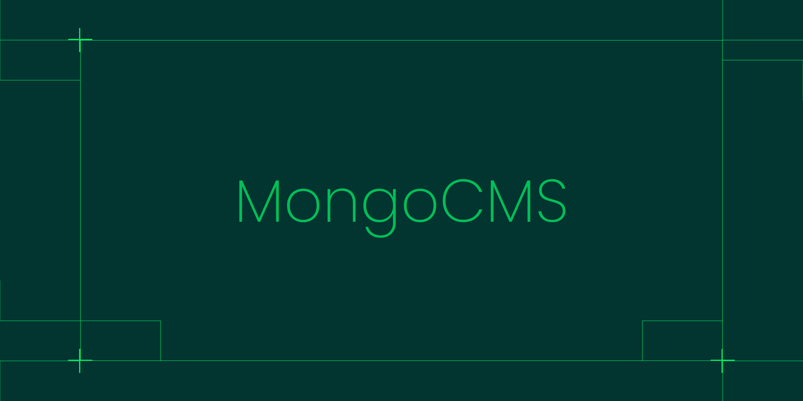

# MongoCMS

Managing a database shouldn't be a headache. If you're tired of dealing with APIs, SDKs, or complex backend setups just to manage content, **MongoCMS** is here to change that. It's a flexible and intuitive CMS that connects **directly** to your **own MongoDB database**, giving you full control over your data. Let's dive into what makes MongoCMS special!

---

## 🚀 What is MongoCMS?
MongoCMS is a **headless, self-hosted content management system (CMS)** that lets you connect your own **MongoDB database or cluster** and manage your content through a **user-friendly UI**. Unlike traditional CMS platforms that store your data on their servers, MongoCMS ensures **you own your data**—everything stays in your database.

## 🎯 Why Use MongoCMS?
- **No Extra Backend Needed** – Just connect your database and start managing content.
- **Full Data Ownership** – Your data stays in **your** MongoDB database.
- **No Vendor Lock-in** – No custom APIs or SDKs—just use MongoDB as you normally would.
- **Role-Based Access Control** – Grant different permissions to team members.
- **Notion-Style Views & Filters** – Organize and visualize data your way.
- **Simple Collaboration** – Invite team members easily and manage access.

---

## 🔌 Connecting Your Database
MongoCMS integrates **directly** with your MongoDB database. Just provide your **MongoDB Compass Connection String or URI**, and you're good to go. MongoCMS **encrypts** your URI before saving it—so security is covered.

---

## 🏗️ Structuring Content (Schemas)
A MongoDB collection **needs structure** to make sense. With MongoCMS, you can define your content structure (schemas) through the UI or code. This ensures that all content follows a consistent format.

- Example: A **blog** project might have a `blog-posts` collection with fields like `title`, `author`, `content`, and `published_at`.
- Example: An **e-commerce inventory** project might have a `shop-items` collection with fields like `item-id`, `name`, `price`, and `in-stock`.

Once your schema is set, **only valid data** can be added—keeping your database clean.

---

## 🔒 Role-Based Access Control
Not everyone should have the same level of access. MongoCMS provides **granular permissions** so you can define roles for your team members:

- **Owner** – Full control over the project.
- **Admin** – All permissions except deleting the project.
- **Editor** – Can add/manage content but may have restricted schema access.
- **Viewer** – Can only view database entries.
- **Custom Roles** – Create roles with specific permissions (just like Discord!).

This ensures **secure and organized collaboration**.

---

## 🔍 Views & Filters (Like Notion!)
Organizing large datasets is tricky. MongoCMS introduces **Notion-style views and filters** to help you navigate your data easily.

- Want to see only **in-stock** items? ✅
- Need a list of **pending orders**? ✅
- Want a custom **dashboard of recent blog posts**? ✅

Just create a **custom view** and apply filters—it’s that simple.

---

## 🤝 Collaboration Made Easy
MongoCMS makes team collaboration **super smooth**:
- **Invite team members** via a simple link.
- **No account registration needed**—just verify via email.
- **New members start as Viewers** until granted more permissions.
- **Admins approve new members** before they can make changes.

This is perfect for companies, teams, or even freelance projects.

---

## 🔧 No APIs or SDKs Needed
One of MongoCMS’s **biggest advantages** is that you don’t need to learn a new API or install custom SDKs. Just use MongoDB **as you normally would**.

- Fetch data? Use your existing MongoDB queries.
- Insert content? Use your favorite MongoDB ODM.
- No need to worry about CMS-specific APIs or vendor lock-in.

MongoCMS **fits into your existing workflow** seamlessly.

---

## 🎯 Use Cases
MongoCMS is perfect for various use cases. Here are just a few:

### 1️⃣ Blog Management
- Define a `blog-posts` collection.
- Add posts directly from MongoCMS.
- Display posts on your website by **fetching data directly from MongoDB**—no backend required!

### 2️⃣ E-Commerce Inventory Management
- Create a `shop-items` collection.
- Add fields like `item-id`, `name`, `price`, `in-stock`, etc.
- Team members can update inventory through the CMS—frontend fetches items directly from MongoDB.

### 3️⃣ Order Management for E-Commerce
- Create an `orders` collection.
- Assign employees **Viewer** roles to see pending orders.
- They can **filter and track** orders without editing any data.

---

## 🎉 Ready to Try MongoCMS?
MongoCMS makes database management **effortless**—whether you're handling a blog, an e-commerce store, or any other structured data.

🚀 **Start managing your MongoDB content the easy way with MongoCMS!**
